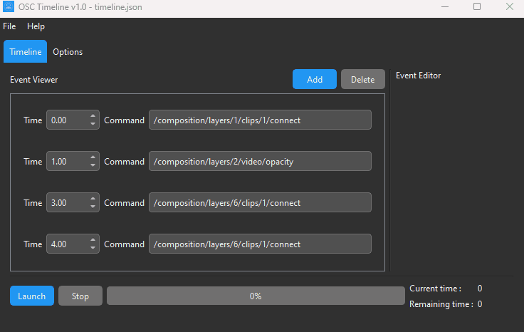

# Introduction

## Presentation

The OSC Timeline software is a PyQt6-based application that allows users to create and manage timelines of events for controlling and sending OSC (Open Sound Control) commands over network. It provides a graphical user interface (GUI) where users can create, edit, and visualize events within a timeline.

Thanks to this, you can easily build a sequence of OCS commands to be launched one after the other, in chronological order, to control other software. I personally use it to program my show on Resolume, a mapping software.



## Features

- [x] Creation, editing, and deletion of events in the timeline
- [x] Display of event attributes in the GUI for easy editing in a customized dark theme
- [x] Loading and saving of timelines from JSON files
- [x] Real-time visualization of the timeline progress using a progress bar and a chronometer
- [x] Control of the timeline, including launching, pausing, resuming, and stopping
- [x] Supports one OSC Server

### Upcomming features

- [] Use a `QGraphicViewer` to display the timeline instead of a customized `QScrollArea`
- [] Supports independant OSC servers for each event instead of only one for all the events

# Installation

## With Python

Use a Python 3.11 virtual env and install the following packages:

```
pyqt6
pyqt6-tools
python-osc
```

## From Build

You can download the portable executable from the GitHub release menu.
You simply have to run it.

You can perform a build in one file executable thanks to pyinstaller. Don't forget to add the dependencies to the file:

```
pyinstaller --onefile --windowed --icon "ui/resources/icon.ico" --add-data "ui/resources/;ui/resources/" main.py
```

# Contribute to this project

You can freely contribute and add new feature to this project. If you want to modify the program, please do it in the dev branch.

Feel free to contact me, it will be a pleasure to discuss about the future of this application !

# Thanks

- Thanks to attwad for its Python-Osc module, simple but efficient: https://github.com/attwad/python-osc
- Thanks to Iris Li for her timeline icon (which fits perfectly for my logo): https://thenounproject.com/icon/timeline-32180/

# Architecture

## Model Classes

1. Timeline Class:

- The `Timeline` class represents the timeline of events. It manages a collection of events and provides methods to add, remove, and update events.
- The state property represents the state of the timeline, which can be `State.NOT_RUNNING`, `State.RUNNING`, or `State.PAUSED`.
- The progress property represents the progress of the timeline, indicating the current event being processed.
- The ip and port properties define the IP address and port for the OSC server.
- Provides methods to run, pause, resume, and stop the timeline, as well as methods to add, remove, and update events.

2. Event Class:

- The `Event` class represents an event in the timeline. It has properties such as time, command, and control.
- The time property represents the time at which the event occurs.
- The command property is the command associated with the event.
- The control property is an instance of the Control class, representing the control for the event.

3. Control Class:

- The `Control` class represents a control for an event. It has properties such as mode, value, and duration.
- The mode property defines the control mode, which can be either `ControlMode.UNIQUE` (single value sent) or `ControlMode.ANIMATED` (mimic a fader).
- The value property represents the value of the control. For the unique mode, it can be a single float, int, or string. For the animated mode, it is a list of two floats or ints.
- The duration property is the duration in seconds for the animated control.

In summary:
The `Control` class is used by the `Event` class to represent the control of an event (send only one value or a serie of interpolation of two values between a specified duration)
The `Event` class is used by the `Timeline` class to represent an event within the timeline.
The `Timeline` class manages a collection of Event objects and uses the Control class to handle the controls associated with the events.
The `MainWindow` class, uses an instance of the `Timeline` class to manage the timeline and its events.

## ViewController classes

1. MainWindow:

- Main controller for the application: managing the UI, handling user interactions, and coordinating the functionality of the underlying classes to create and control timelines with associated events
- Manages the UI elements and controls the interaction between different components.
- Creates and manages instances of `EventWidget` to display and edit events in the `EventWidgetScrollArea`.
- Controls the timeline state and updates the UI based on the timeline's progress.

2. EventWidgetScrollArea:

- Inherits from `QScrollArea` and provides a scrollable area to display event widgets.
- Manages the addition, removal, and selection of event widgets.
- Emits signals when the selected event ID changes.
- Connects signals from event widgets to handle selection and time updates.

3. EventWidget:

- Represents a single event in the timeline.
- Provides a custom widget for displaying and editing event attributes such as the event's time or command
- Allows editing of event attributes and emits signals when the time or command is updated.
- Handles mouse events for selection and highlighting.
